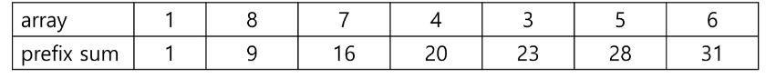

## 누적합이란 ?
`누적합`부터 먼저 설명하면 0번째 인덱스부터 N 번째 인덱스까지 탐색하면서 인덱스 i 일때 0번째 인덱스부터 i번째 인덱스까지의 합을 말한다.  
이를 Java 언어로 표현하자면 다음과 같다.

```java
import java.util.Arrays;

public class Main {

	public static void main(String[] args){
		int[] array = {1, 8, 7, 4, 3, 5, 6};
		int n = array.length;
		int[] prefix_sum = new int[n];
		
		for(int i = 0; i < n; i++) {
			for(int j = 0; j <= i; j++) {
				prefix_sum[i] += array[j];
			}
		}
	}
}
```

위 코드처럼 표현할 수 있고 sum 함수를 이용할 수도 있지만, 위 코드는 O(N^2) 시간 만큼 걸린다. 하지만 밑의 방식으로 할 경우 O(N) 으로 처리가 가능하다.

```java
public class Main {

	public static void main(String[] args){
		int[] array = {1, 8, 7, 4, 3, 5, 6};
		int n = array.length;
		int[] prefix_sum = new int[n + 1];
		
		for(int i = 0; i < n; i++) {
			prefix_sum[i + 1] = prefix_sum[i] + array[i];
		}
	}
}
```

## 구간합이란?
`구간합`은 누적합에서 구간 간의 차이만 빼면 된다.



위 표에는 배열과 누적합의 결과를 나타내고 있다. 예시로 2 번째 인덱스에서 5번째 인덱스 사이의 값을 구하고자 할 때
array는 7 + 4 + 3 + 5 순서로 for 문을 돌리면 O(N) 만큼 시간이 걸리지만, prefix sum 은 28-9 로 O(1) 만큼 걸리는 것을 알 수 있다.


```java
public class Main {

	public static void main(String[] args){
		int[] array = {1, 8, 7, 4, 3, 5, 6};
		int n = array.length;
		int[] prefix_sum = new int[n + 1];
		int x = 1;
		int y = 5;
		
		for(int i = 0; i < n; i++) {
			prefix_sum[i + 1] = prefix_sum[i] + array[i];
		}
        
		int part_sum = prefix_sum[y] - prefix_sum[x - 1];
	}
}
```

[맨 위로 이동하기](#){: .btn .btn--primary }{: .align-right}
