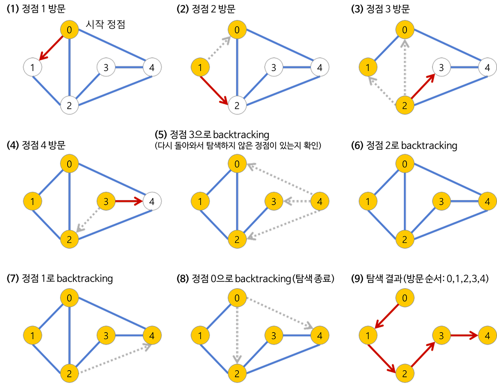
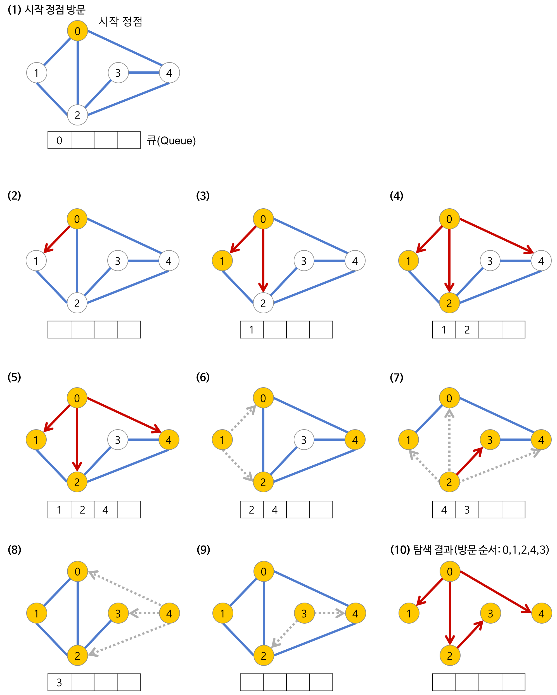

# DFS 와 BFS 알고리즘
**DFS** 와 **BFS**는 그래프의 모든 노드를 방문하여 해를 찾는 그래프 이론 알고리즘이다.  
여기서 그래프란, **정점(node)** 와 그 정점을 연결하는 **간선(edge)** 으로 이루어진 자료구조의 일종을 말하며, 그래프를 탐색한다는 것은 **하나의 정점으로부터 시작하여 차례대로 모든 정점들을 한 번 씩 방문하는 것**을 말한다.
  
  

## DFS (깊이 우선 탐색)
**DFS**는 임의의 노드에서 시작해서 다음 분기로 넘어가기 전에 해당 분기를 완벽하게 탐색한 후 넘어가는 방법이다.  
예를 들어, 미로찾기를 할 때 최대한 한 방향으로 갈 수 있을 때까지 쭉 가다가 더 이상 갈 수 없게 되면 다시 가장 가까운 갈림길로 돌아와서 그 갈림길부터 다시 다른 방향으로 탐색을 진행하는 것이 DFS 방식이다.  
  
DFS의 자세한 탐색 과정은 다음과 같다.




### 특징
1. 자기 자신을 호출하는 순환 알고리즘의 형태를 가지고 있다.
2. 구현 시 어떤 노드를 방문했는지 여부를 검사해야 한다. (검사하지 않을 경우 무한루프에 빠질 가능성이 있다.)
3. 한 개의 노드에서 자식 노드를 방문하고, 방문한 노드에서 다시 그 자식 노드를 방문하기 때문에 LIFO 구조를 가지고 있다. 따라서 stack 자료구조를 이용해 구현할 수도 있다.
4. 목표 노드가 깊은 단계에 있을 경우 해를 빨리 구할 수 없기 때문에 얻어진 해가 최단 경로가 된다는 보장은 없다.

### 자바 코드
다음은 재귀함수를 이용한 DFS 자바 코드이다.  
  

```java
public class Graph {
    private int length;
    private LinkedList<Integer> adj[];

    Graph(int v) {
        length = v;
        // 인접 리스트 초기화
        for (int i = 0; i < length; i++) {
            adj[i] = new LinkedList<>();
        }
    }

    void addEdge(int v, int w) {
        adj[v].add(w);
    }

    void dfsSearch(int v) {
        boolean visited[] = new boolean[length];

        dfs(v, visited);
    }

    /**
     * dfs 재귀
     */
    void dfs(int v, boolean visited[]) {
        visited[v] = true;
        System.out.println(v + " ");

        ListIterator<Integer> it = adj[v].listIterator();
        while (it.hasNext()) {
            int n = it.next();
            if (!visited[n]) {
                dfs(n, visited);
            }
        }
    }
}
```

## BFS (넓이 우선 탐색)
**BFS**는 임의의 노드에서 시작해 인접한 노드를 먼저 탐색하는 방법이다. 시작 정점으로부터 가까운 정점을 먼저 방문하고 멀리 떨어져 있는 정점을 나중에 방문한다.  
따라서 주로 두 노드 사이의 최단 경로를 찾고 싶을 때 이 방법을 선택한다.  
  
BFS의 자세한 탐색 과정은 다음과 같다.



  
### 특징
1. dfs와 마찬가지로 무한 루프에 빠지지 않기 위해 어떤 노드를 방문했는지 여부를 검사해야 한다.
2. bfs는 방문한 노드들을 차례로 저장한 후 꺼낼 수 있는 자료구조 Queue 를 사용한다.
3. 이 알고리즘은 답이 되는 경로가 여러 개인 경우에도 최단 경로임을 보장한다.


### 자바 코드
다음은 Queue 를 이용한 bfs 자바 코드이다.  
  

```java
public class Graph {
    private int length;
    private LinkedList<Integer> adj[];

    Graph(int v) {
        length = v;
        // 인접 리스트 초기화
        for (int i = 0; i < length; i++) {
            adj[i] = new LinkedList<>();
        }
    }

    void addEdge(int v, int w) {
        adj[v].add(w);
    }

    void bfsSearch(int v) {
        boolean[] visited = new boolean[length];

        bfs(v, visited);
    }

    /**
     * bfs queue
     */
    void bfs(int v, boolean visited[]) {
        LinkedList<Integer> queue = new LinkedList<>();

        visited[v] = true;
        queue.add(v);

        while (queue.size() != 0) {
            int w = queue.poll();
            System.out.println(w + " ");

            Iterator<Integer> i = adj[w].listIterator();
            while (i.hasNext()) {
                int n = i.next();

                if (!visited[n]) {
                    visited[n] = true;
                    queue.add(n);
                }
            }
        }
    }
}
```

[맨 위로 이동하기](#){: .btn .btn--primary }{: .align-right}
