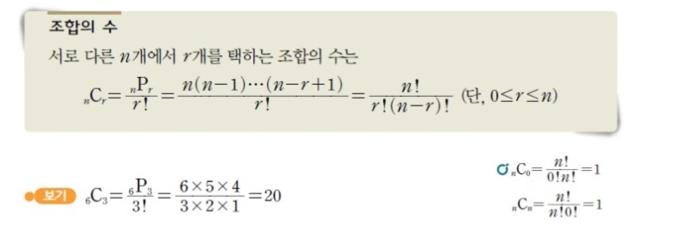

[BOJ10986 나머지 합](https://www.acmicpc.net/problem/10986)


## 문제풀이

문제에 주어진 A1, A2, ... , An 이 있을 때 연속된 부분 구간의 합이 m 으로 나누어 떨어지는 구간의 개수를 구하는 문제이다.
일단 누적합 일차원 배열 S[n] 을 정의하고 구간합 S[j] - S[i-1] 이 m 으로 나누어 떨어지는 개수를 구하면 된다.
이를 수학적으로 풀어보면 다음과 같다.

        (S[j] - S[i-1]) % m = 0
        S[j] % m - S[i-1] % m = 0
        -> S[j] % m = S[i-1] % m

즉, 누적 값을 m 으로 나눈 나머지 값이 일치하는 i, j 값들을 구하고 그 i, j 의 경우의 수들의 합을 구하면 된다.

예제 입력으로 주어진 값들로 예를 들면 다음과 같다.

        A[n] = {1, 2, 3, 1, 2}
        S[n] = {1, 3, 6, 7, 9}
        S[n] % 3 = {1, 0, 0, 1, 0}

S[n] % 3 배열에서 값이 일치하는 서로 다른 인덱스값 i, j 의 경우의 수들의 합을 구하면 된다.  

다만 경우의 수를 구하는 방법을 단순 for 문으로 해결하려 한다면 시간초과가 날 수 있다. 따라서 이번엔 경우의 수를 수학적으로 풀이할 수 있는 '조합' 을 이용할 것이다.




먼저 나머지 값이 같은 인덱스들의 개수를 저장하는 배열을 만들자.

주어진 예제로 예를 들면 다음과 같을 것이다.

        int[] B = new int[m];
        B[0] = 3;
        B[1] = 2;
        B[0] = 0;


위 공식을 이용해 B[m] 의 경우의 수 값을 구해보자.

        3C2 + 2C2 = 3*2/2*1 + 2*1/2*1
        B[i]C2 = (B[i] * (B[i]-1)) / 2

주의해야 할 점이 있다. 문제 조건 상 (i ≤ j) 이기 때문에 S[i] % m = 0 인 경우에는 결과값에 포함시켜줘야 한다.

```java
import java.io.BufferedReader;
import java.io.IOException;
import java.io.InputStreamReader;
import java.util.StringTokenizer;

public class Main {
    public static void main(String[] args) throws IOException {
        BufferedReader br = new BufferedReader(new InputStreamReader(System.in));
        StringTokenizer st = new StringTokenizer(br.readLine());

        int n = Integer.parseInt(st.nextToken());
        int m = Integer.parseInt(st.nextToken());
        long[] prefixSum = new long[n + 1];
        long[] sumCount = new long[m];

        st = new StringTokenizer(br.readLine());
        for (int i = 1; i < n + 1; i++) {
            prefixSum[i] = (prefixSum[i - 1] + Integer.parseInt(st.nextToken())) % m ;
            sumCount[(int) prefixSum[i]]++;
        }


        long count = sumCount[0];
        for (int i = 0; i < m; i++) {
            if (sumCount[i] > 1) {
                count += (sumCount[i] * (sumCount[i] - 1) / 2);
            }
        }

        System.out.println(count);
        br.close();
    }
}
```


[맨 위로 이동하기](#){: .btn .btn--primary }{: .align-right}
