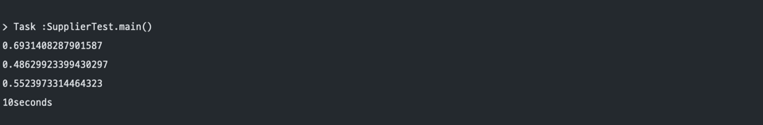
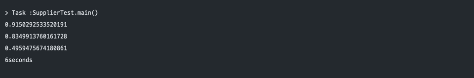

## Supplier 인터페이스

**Supplier Interface**는 Java8부터 도입된 함수형 인터페이스로 다음과 같이 get 메서드를 통해 T 타입을 반환하는 단 하나의 메서드만을 가지고 있습니다.  
  
```java
package java.util.function;

/**
 * Represents a supplier of results.
 *
 * <p>There is no requirement that a new or distinct result be returned each
 * time the supplier is invoked.
 *
 * <p>This is a <a href="package-summary.html">functional interface</a>
 * whose functional method is {@link #get()}.
 *
 * @param <T> the type of results supplied by this supplier
 *
 * @since 1.8
 */
@FunctionalInterface
public interface Supplier<T> {

    /**
     * Gets a result.
     *
     * @return a result
     */
    T get();
}
```  
  
### 사용 방법

사용 방법은 매우 간단합니다. 
다음과 같이 람다 표현식을 통해 정의하고 get() 메서드를 통해 값을 반환하여 사용합니다.
```java
class Main {
    public static void main(String[] args) {
        Supplier<String> helloSupplier = () -> "Hello !";
        String hello = helloSupplier.get();
        
        System.out.println(hello);
    }
}
```  
  
  
### 장점

**Supplier Interface**의 진정한 효용가치는 **Lazy Evaluation**을 할 수 있다는 데에 있습니다.  
예를 들어봅시다. 

```java
public class SupplierTest {

    public static void main(String[] args) throws InterruptedException {
        long startTime = System.currentTimeMillis();

        for (int i = -1; i < 4; i++) {
            printRandom(i, getRandom());
        }

        System.out.println((System.currentTimeMillis() - startTime) / 1000 + "seconds");
    }

    static double getRandom() throws InterruptedException {
        TimeUnit.SECONDS.sleep(2);

        return Math.random();
    }

    static void printRandom(int x, double d) {
        if (x > 0) {
            System.out.println(d);
        }
    }
}
```

<br/>

위 코드에서 `printRandom()` 메서드는 매개변수 x 가 양수일 때 d 값을 출력하는 함수입니다. 
-1 부터 4 까지의 범위에서 `printRandom()` 메서드는 양수일 때 값을 출력하기 때문에 전체 걸리는 시간은 6초(x = 1, 2, 3 일 때) 라고 추측할 수 있지만 실상은 다릅니다.


  
<br/>
  
`getRandom()` 메서드는 조건에 상관없이 항상 실행이 되기 때문에 6초가 아닌 10초가 걸리게 됩니다. 
만약 getRandom() 메서드의 연산 처리 비용이 매우 비싸다고 가정한다면 이것은 엄청난 자원의 손실로 이어질 것입니다.  
반면 같은 코드에서 Supplier 함수형 인터페이스를 사용했을 때의 결과는 어떻게 나오는 지 살펴봅시다.
```java
public class SupplierTest {

    public static void main(String[] args) throws InterruptedException {
        long startTime = System.currentTimeMillis();

        for (int i = -1; i < 4; i++) {
            printRandom(i, getRandomWithSupplier());
        }

        System.out.println((System.currentTimeMillis() - startTime) / 1000 + "seconds");
    }

    static Supplier<Double> getRandomWithSupplier() {
        return () -> {
            try {
                TimeUnit.SECONDS.sleep(2);
            } catch (InterruptedException e) {
                throw new RuntimeException(e);
            }
            return Math.random();
        };
    }

    static void printRandom(int x, Supplier<Double> d) {
        if (x > 0) {
            System.out.println(d.get());
        }
    }
}
```


결과값의 차이가 보이시나요? 
놀랍게도 Supplier를 활용한 결과값을 보면 맨 처음 우리가 추측했던 대로 동작하고 있음을 알 수 있습니다.    
    
이처럼 **함수 실행을 원하는 시점에 할 수 있도록 조절하는 것**을 또한 `Lazy Evaluation` 이라고 하며, 이를 적절히 사용할 경우 성능 향상을 기대할 수 있습니다.


[맨 위로 이동하기](#){: .btn .btn--primary }{: .align-right}
