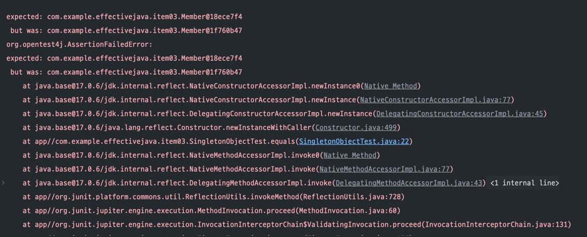
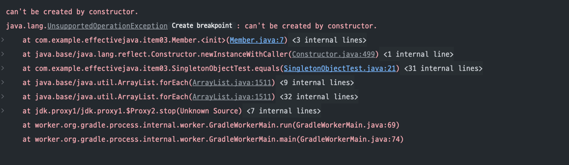
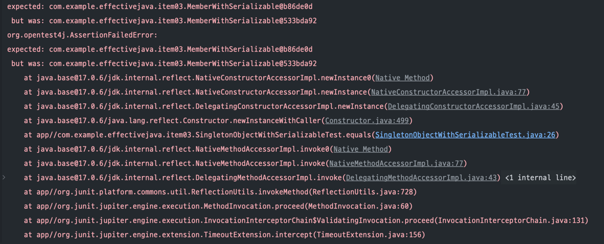
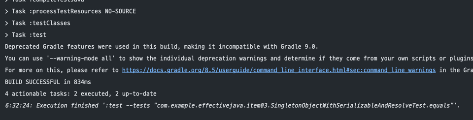
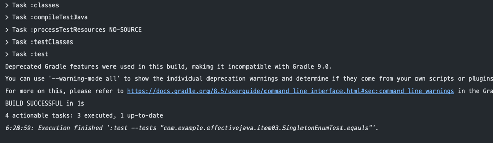
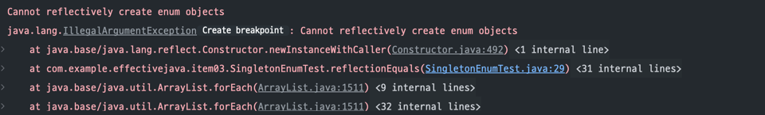

# #3.private 생성자나 열거 타입으로 싱글턴임을 보증하라

`싱글톤(Singleton)` 이란 인스턴스를 오직 하나만 생성하여 사용하는 클래스를 말한다. 싱글톤의 전형적인 예로는 함수와 같은 무상태(stateless) 객체나 설계상으로 유일해야 하는 
시스템 컴포넌트를 들 수 있다.

단점) 클래스를 싱글턴으로 만들면 이를 사용하는 클라이언트를 테스트하기가 어려워진다. 싱글톤 인스턴스를 mock 구현으로 대체하기 힘들기 때문이다.

## 싱글톤 생성 방법 #1
싱글톤을 만드는 첫 번째 방법은 생성자를 private 로 감춰두고 유일한 인스턴스를 static final 로 지정하는 방법이다. 
public 이나 protected 생성자가 없으므로 인스턴스는 전체 시스템에서 하나뿐임이 보장된다.

```java
public class Member {
    private static final Member instance = new Member();
    private Member() {}
}
```
  
다만, 권한이 있는 클라이언트는 리플렉션 API인 AccessibleObject.setAccessible 을 이용해 private 생성자를 호출할 수 있어 싱글톤이 깨질 수 있다.
  
  
아래 테스트 코드는 우리가 만든 싱글톤 Member 객체와 리플렉션 API 를 이용해 새로 생성한 객체를 비교하는 테스트 코드이다.
```java
class SingletonObjectTest {
    
    @Test
    void equals() throws NoSuchMethodException, InvocationTargetException, InstantiationException, IllegalAccessException {
        Member instance1 = Member.instance;

        // reflection API 를 이용한 새로운 객체 생성
        Class<?> classType = Member.class;
        Constructor<?> constructor = classType.getDeclaredConstructor();
        constructor.setAccessible(true);
        Member instance2 = (Member) constructor.newInstance();

        assertThat(instance1).isEqualTo(instance2);
    }
}
```

`Constructor` 객체는 자신에 대한 접근 가능 여부를 직접적으로 변경할 수 있는 setAccessible() 메서드를 제공하기 때문에 해당 생성자의 접근 제어자가 private 임에도 새로운 인스턴스를
생성할 수 있다.
따라서 이 테스트를 실행시키면 실패한다.
  


이 경우를 예방하려면 생성자를 수정하여, 두 번째 객체가 생성되려 할 때 예외를 던지게 해야 한다.

```java
public class Member {
    public static final Member instance = new Member();

    private Member() {
        if (instance != null) {
            throw new UnsupportedOperationException("can't be created by constructor.");
        }
    }
}
```

예를 들어 이런 식으로 변경하고 테스트 코드를 실행하면


다음과 같이 예외를 통해 싱글톤이 깨지는 것을 방지하고 있음을 알 수 있다.


## 싱글톤 생성 방법 #2
싱글톤을 만드는 두 번째 방법은 `정적 팩토리 메서드` 를 public static 멤버로 제공하는 것이다.

```java
public class Member2 {
    private static Member2 member2 = new Member2();
    public static Member2 getInstance() {
        return member2;
    }

    private Member2() {}
}
```
  
이 방식의 장점은 다음과 같다.
  
- API를 바꾸지 않고도 싱글톤이 아니게 변경할 수 있다.
- 정적 팩토리를 제네릭 싱글톤 팩토리로 만들 수 있다.(item 30)
- 정적 팩토리의 메서드 참조를 공급자(supplier)로 사용할 수 있다. (item 43, 44)  
  
다만 이 방식의 경우에도 리플렉션 API를 통한 새로운 인스턴스 생성이 가능하다.
이러한 장점들이 굳이 필요하지 않다면 public 필드 방식이 더 좋다.


### 역직렬화로 깨지는 싱글톤
자바의 `직렬화(Serialize)`는 JVM의 힙 메모리에 있는 객체 데이터를 바이트 스트림(byte stream) 형태로 바꿔 외부 파일로 내보낼수 있게 하는 기술을 말한다. 
반대로 외부로 내보낸 직렬화 데이터를 다시 읽어들여 자바 객체로 재변환하는 것을 `역직렬화(Deserialize)` 라 한다.  
이 직렬화를 적용하기 위해선 클래스에 `Serializable` 인터페이스를 implements 하면 된다.  
그런데 위에서 설명한 두 방식의 경우 송신자가 직렬화 된 클래스를 받고 역직렬화 시 싱글톤이 깨지게 된다.
  
  
다음은 직렬화하고자 하는 객체의 예시를 들어봤다.
```java
public class MemberWithSerializable implements Serializable {
    private static MemberWithSerializable member = new MemberWithSerializable();
    private MemberWithSerializable() {}

    public static MemberWithSerializable getInstance() {
        return member;
    }
}
```

다음은 위 클래스를 역직렬화 했을 때 객체가 같은 지 비교하는 테스트 코드이다.
```java
class SingletonObjectWithSerializableTest {
    @Test
    void equals() throws IOException, ClassNotFoundException {
        MemberWithSerializable member1 = MemberWithSerializable.getInstance();
        String fileName = "object.obj";

        // 직렬화
        ObjectOutputStream out = new ObjectOutputStream(new BufferedOutputStream(new FileOutputStream(fileName)));
        out.writeObject(member1);
        out.close();

        // 역직렬화
        ObjectInputStream in = new ObjectInputStream(new BufferedInputStream(new FileInputStream(fileName)));
        MemberWithSerializable member2 = (MemberWithSerializable) in.readObject();
        in.close();

        assertThat(member1).isEqualTo(member2);
    }
}
```

  
  
위 테스트를 실행하면 다음과 같이 실패하는 것을 알 수 있다.

  
  
이러한 현상이 생기는 이유는 역직렬화 자체가 보이지 않는 생성자로서 역할을 수행하기 때문에 인스턴스를 또다시 만들어, 직렬화에 사용한 인스턴스와는 전혀 다른 인스턴스가 되기 때문에 일어나는 것이다. 
따라서 클래스에 Serializable을 구현하면 더 이상 이 클래스는 싱글톤이 아니게 된다.  
  
그럼 이 현상을 극복하는 대안에 대해 설명하겠다.
  
### 싱글톤 역직렬화 해결법
역직렬화 시 싱글톤이 깨지는 현상에 대한 해결법은 직렬화 관련 메서드인 `readResolve()` 를 활용하는 것이다.  
`readResolve()` 메서드를 직접 정의하여 역직렬화 과정에서 만들어진 인스턴스 대신에 기존에 생성된 싱글톤 인스턴스를 반환하는 식으로 해결한다.
  
  
만일 역직렬화 과정에서 자동으로 호출되는 *readObject* 메서드가 있더라도 *readResolve* 메서드에서 반환한 인스턴스로 대체된다. *readObject* 메서드를 통해 만들어진 인스턴스는 가비지 컬렉션 대상이 된다.

```java
public class MemberWithSerializableAndResolve implements Serializable {
    private static MemberWithSerializableAndResolve member = new MemberWithSerializableAndResolve();
    private MemberWithSerializableAndResolve() {}

    public static MemberWithSerializableAndResolve getInstance() {
        return member;
    }

    @Serial
    private Object readResolve() {
        return member;
    }
}
```
 *MemberWithSerializableAndResolve* 클래스를 테스트해 보면 똑같은 객체가 성공적으로 반환됨을 알 수 있다.
 
  
  
다만 *readResolve()* 메서드를 정의했다 하더라도 역직렬화 과정 중간에 역직렬화된 인스턴스의 참조를 훔쳐오는 공격을 행할 경우 다른 객체로 변경될 위험이 있기 때문에 
다음과 같이 모든 인스턴스의 필드를 `transient` 로 선언해 주는 것이 좋다.
```java
public class MemberWithSerializableAndResolve implements Serializable {
    private static MemberWithSerializableAndResolve member = new MemberWithSerializableAndResolve();
    transient String id = "";
    transient String name = "";
    transient int age = 0;
    private MemberWithSerializableAndResolve() {}

    public static MemberWithSerializableAndResolve getInstance() {
        return member;
    }

    @Serial
    private Object readResolve() {
        return member;
    }
}
```
## 싱글톤 생성 방법 #3
지금까지 싱글톤 생성 두 가지 방법과 리플렉션, 역직렬화에서 싱글톤이 깨지지 않는 방법에 대해 알아보았다. 그러나 이보다 더 간결하고, 추가 노력 없이 싱글톤 형태가 깨지지 않는 싱글톤 생성 방법이 있다.  
그것은 바로 `열거 타입 방식의 싱글톤 생성` 방법이다.  
  
자바에서 Enum은 클래스로 취급되기 때문에 Enum 객체를 이용하면 아주 간단하게 싱글톤 객체를 구성할 수 있다. Enum은 멤버를 만들 때 private로 만들고 한 번만 초기화되기 때문에 그 자체로도 Thread-Safe 하다. 
또한 Enum 내에서 상수 뿐만 아니라 변수나 메서드를 선언해 사용이 가능하기 때문에 독립된 싱글톤 클래스 처럼 응용이 가능하다.  
  
또한 Enum은 클라이언트에서 리플렉션 공격에도 안전하고, 기본적으로 Serializable 인터페이스를 구현하고 있기 때문에 직렬화도 가능하다. 따라서 직렬화가 필요하고 싱글톤 형태의 구조가 필요하다면 Enum 타입 싱글톤 생성을 
가장 먼저 고려하는 것이 좋다.  
  
  ```java
public enum EnumTypeMember {
    INSTANCE;
    private String name = "";

    public String getName() {
        return name;
    }
}
```
  
다음은 인스턴스가 같음을 확인하는 테스트 코드이다.
```java
class SingletonEnumTest {
    @Test
    void eqauls() {
        EnumTypeMember member = EnumTypeMember.INSTANCE;
        EnumTypeMember member2 = EnumTypeMember.INSTANCE;

        assertThat(member).isEqualTo(member2);
    }
}
```



테스트 결과를 보면 알 수 있듯이 같은 인스턴스 객체를 가지고 있음을 알 수 있다.  
이제 리플렉션에 싱글톤에 깨지는 지 테스트 해보자.

```java
class SingletonEnumTest {
    @Test
    void reflectionEquals() throws NoSuchMethodException, InvocationTargetException, InstantiationException, IllegalAccessException {
        EnumTypeMember member = EnumTypeMember.INSTANCE;

        // reflection API 를 이용한 객체 생성
        Class<?> classType = EnumTypeMember.class;
        Constructor<?>[] constructors = classType.getDeclaredConstructors();
        for(Constructor<?> constructor : constructors){
            constructor.setAccessible(true);
            EnumTypeMember member2 = (EnumTypeMember) constructor.newInstance("INSTANCE");

            assertThat(member).isEqualTo(member2);
        }
    }
}
```


위 테스트를 실행해보면 다음과 같이 리플렉션을 통한 인스턴스 생성을 막아놓았음을 알 수 있다.


[맨 위로 이동하기](#){: .btn .btn--primary }{: .align-right}
