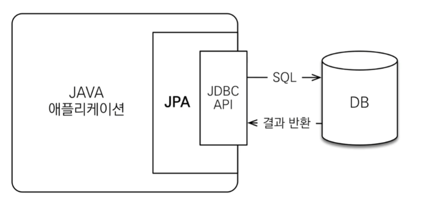
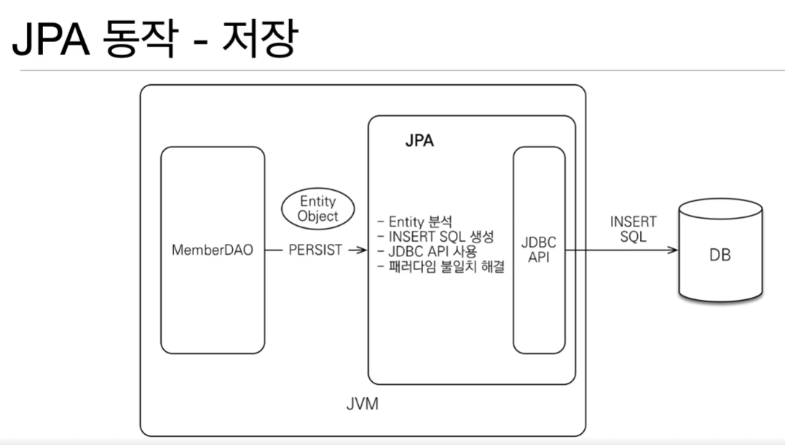

## Spring JPA 란 ?
`JPA`란 자바 진영에서 ORM 기술 표준으로 사용되는 인터페이스의 모음을 말한다. 그 말인 즉, 실제 구현된 것이 아니라 구현된 클래스와 매핑을 해주기 위해 사용되는 프레임
워크이다. JPA를 구현한 대표적인 오픈소스로는 Hibernate 가 있다.

         ORM 이란 ?  
Object-relatinal mapping (객체 관계 매핑) 의 줄임말로 말 뜻 그대로 애플리케이션 class 와 DB의 테이블을 중간에서 매핑해 주는 역할을 한다.

JPA
1. 자바 진영의 ORM 기술 표준
2. 애플리케이션과 JDBC 사이에서 동작한다.

### JPA를 사용해야 하는 이유.
JPA는 애플리케이션과 JDBC 사이에서 동작하기 때문에 개발자에게 많은 이점을 줄 수 있다.
1. SQL 중심적인 개발이 객체 중심으로 개발이 가능하기 때문에 개발자는 객체 모델을 이용해 비즈니스 로직을 구성하는 데 집중할 수 있다.
2. Query를 사용하는 데 필요한 선언문, 할당 등 부수적인 코드가 줄어들어 코드의 가독성을 높일 수 있다.
3. 매핑하는 정보가 Class 로 명시되었기 때문에 ERD 를 보는 의존도를 낮출 수 있고 유지보수 및 리팩토링에 유리하다.
4. 패러다임의 불일치를 해결해준다.
   -> 객체에는 상속이라는 개념이 있는데, 이를 SQL 중심으로 업데이트를 한다고 하면 매핑된 테이블에도 데이터를 넣어야 하므로 여러 번 업데이트를 해줘야 할 것이다. JPA에서는 이 문제를 해결해줄 수 있다.
또한 동일한 트랜잭션에서 조회한 앤티티는 같음을 보장해주어 좀 더 객체지향적으로 개발을 진행할 수 있다.

### 추가적인 이점.
1) SELECT 시 같은 트랜잭션 안에서는 같은 엔티티를 반환하므로 약간의 조회 성능 향상을 기대할 수 있다.
2) INSERT 시 트랜잭션을 커밋할 때까지 INSERT SQL 을 모아 JDBC BATCH SQL 기능을 사용해 한 번에 SQL 을 전송하므로 성능 향상을 기대할 수 있다.
3) UPDATE, DELETE 시 순간적으로 ROW LOCK 이 걸릴 수 있는데 JPA는 트랜잭션 커밋 시 한 번에 쿼리를 보내기 때문에 ROW LOCK 시간 최소화할 수 있다.

영속성 컨텍스트
- JPA를 이해하는데 가장 중요한 용어
- "엔티티를 영구 저장하는 환경" 이라는 뜻
- Entitymanager.persist(entity); -> DB에 그냥 저장하는 것이 아니라 엔티티를 영속성 컨텍스트에 저장한다는 뜻이다.

1. 비영속(new/transient)
   영속성 컨텍스트와 전혀 관계가 없는 새로운 상태
2. 영속(managed)
   영속성 컨텍스트에 관리되는 상태
3. 준영속(detached)
   영속성 컨텍스트에 저장되었다가 분리된 상태
4. 삭제(removed)
   삭제된 상태

영속성 컨텍스트의 이점
- 1차 캐시
- 동일성 보장
- 트랜잭션을 지원하는 쓰기지연 -> Entity와 스냅샷을 비교 후 쓰기 지연 SQL 저장소에 쌓아놨다가 트랜잭션 커밋 될 때 실행(flush)
- 변경감지(Dirty Checking)
- 지연로딩(Lazy Loading)

플러시 발생
- 변경 감지
- 수정된 엔티티 쓰기 지연 SQL 저장소에 등록
- 쓰기 지연 SQL 저장소의 쿼리를 DB에 전송 (등록, 수정, 삭제 쿼리)

플러시하는 방법
- em.flush() - 직접 호출
- 트랜잭션 호출 - 플러시 자동 호출
- JPQL 쿼리 실행 - 플러시 자동 호출

책 추천
조영호/객체지향의 사실과 오해
[맨 위로 이동하기](#){: .btn .btn--primary }{: .align-right}
