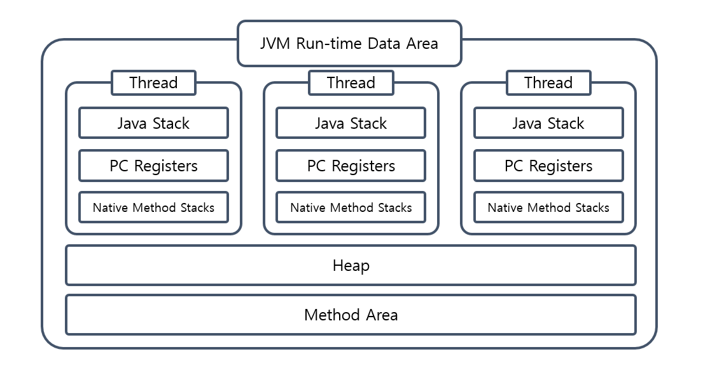
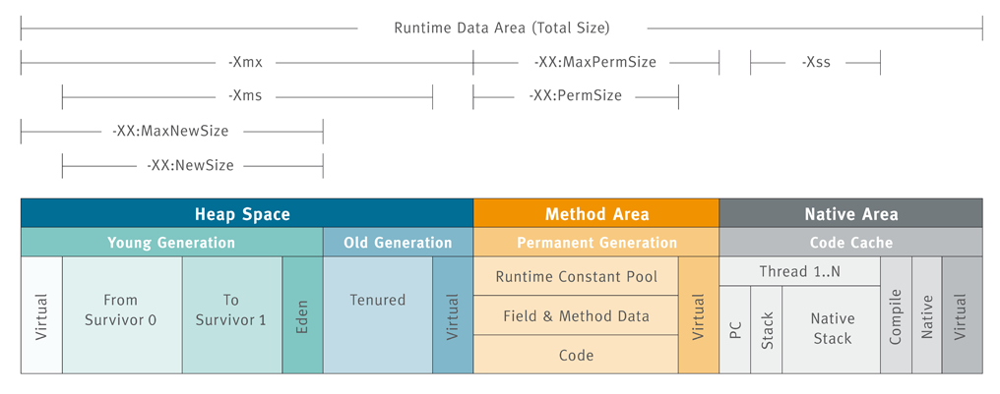
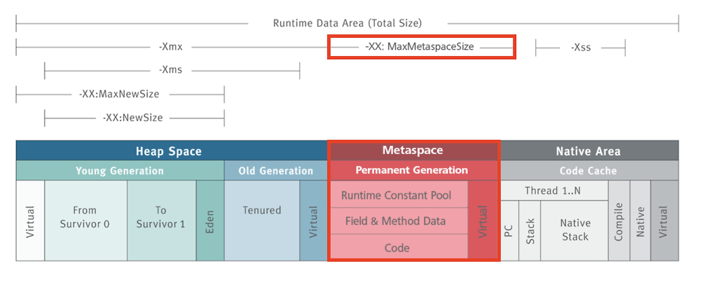
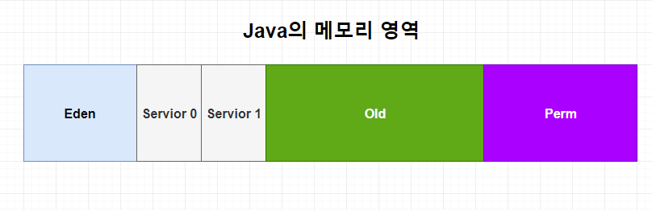
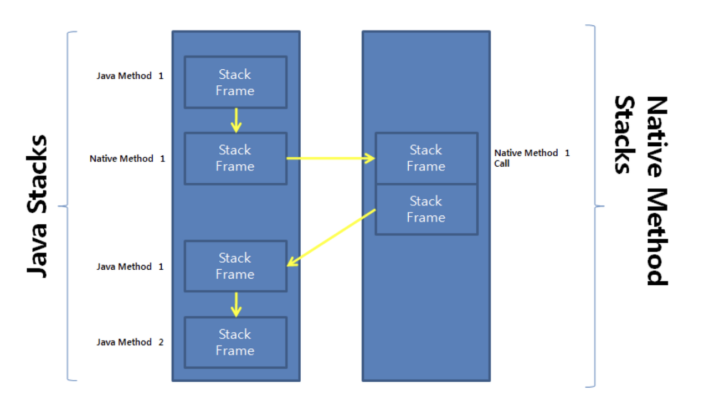

# Runtime Area(런타임 영역)

`런타임 영역` 은 JVM 이 런타임 환경에서 자바 프로그램을 수행할 때 사용되는 데이터들이나 정보들을 저장하기 위해 **OS 로부터 할당받는 메모리 영역**입니다.
이 메모리 영역은 논리적으로 다음과 같이 5가지 영역으로 구분합니다.

 - Method Area
 - Heap Area
 - PC Register
 - Native Method Stack
 - JVM Stack

 

 

## Method Area
 `Method Area` 는 JVM 벤더마다 다르게 구현되어 있습니다. 
 그러나 거의 모든 운영체제에서는 Hotspot 이라는 벤더를 사용하므로 이것을 기준으로 설명하겠습니다.  

//
`Hotspot JVM 벤더`는 JDK 8 버전 기준으로 메모리 영역에 변화가 생겼습니다. 
크게는 기존 Perm 영역(Perm Generation) 이 사라지고 Metaspace 영역이 등장하게 되었는데요. 
그럼 변화된 Method Area 가 JVM 에서 어떤 역할을 하는지, JDK 8 버전이 되며 어떤 변화가 생겼는지 알아보겠습니다.
//

`Method Area`는 가장 먼저 데이터가 저장되는 영역으로 클래스 로더에 의해 로드된 클래스, 메소드 정보와 클래스 변수 정보들이 저장됩니다.
이 공간에 저장된 정적 변수는 클래스 수준의 변수로 모든 인스턴스가 공유하며, 데이터는 프로그램이 종료될 때까지 저장되게 됩니다.
또한 이 공간은 모든 스레드가 공유한다는 특징이 있습니다.  
  
`Method Area`는 Java 8버전 이전과 이후로 크게 달라진 점이 있는데요.
`Method Area` 가 정확히 무슨 역할을 하고 무엇이 크게 달라졌는지 알아봅시다.

### Java 8 이후 변경점

Java 7 이하 버전에서는 클래스의 메타 데이터들이 아래 그림과 같이 `Perm Generation` 이라 명칭하는 공간에 저장됩니다.

 

`Perm Generation`은 Method Area에 속해있지만, 사실 Heap Area 에서 분리된 특수한 공간에 위치합니다.
이것을 오라클 공식 문서에서는 logical 하게 heap에 속한다 설명하고 있습니다.  
  따라서 해당 영역은 고정 크기로 할당이 되기 때문에 클래스 로딩 및 언로딩 작업이 빈번하게 발생할 경우 메모리 부족으로 인한 OutOfMemorryError가 발생하였습니다.

 

이런 고질적인 메모리 부족 문제를 해결하기 위해 Java 8 버전 부터는 `Perm Generation`이 `Metaspace Area`로 대체되었습니다.
`Metaspace Area`는 heap area 에 위치하는 것이 아니라 JVM에 의해 메모리가 제한되지 않는 Native Memory 영역에 위치해 OS에 의해 메모리 할당 공간이 자동으로 조절됩니다.
따라서 이론상 아키텍쳐가 지원하는 메모리 크기까지 확장할 수 있게 되어, 이전 버전에서 문제가 되던 메모리 부족과 관련된 문제를 해결할 수 있습니다.   

 
  
`Metaspace Area`는 메서드의 바이트 코드뿐만 아니라 클래스와 인터페이스의 메타데이터도 저장합니다.
이는 클래스의 구조, 필드 정보, 메서드 시그니처 등을 포함하는데요.
이렇게 됨으로써 중요한 정보들을 한 곳에서 쉽게 액세스 할 수 있게 되었으며, 
클래스의 구조 변경 시에도 메서드 영역 전체를 갱신할 필요가 없어져 메모리 사용량을 줄이고 클래스 로딩과 언로딩의 성능을 향상시킬 수 있게 되었습니다.
그리고 이런 메타데이터의 존재는 리플렉션과 같은 기능을 지원하는 데에도 도움이 됩니다.  

다음으로 `Metaspace Area`의 중요한 변경점은 '**string 과 static object 의 저장 방법**'입니다.
JDK 7 이하 버전에서는 문자열 리터럴 방식을 통해 생성하는 string 값은 `Runtime Constant Pool` 에 저장었습니다. 
그러나 JDK 8 버전 이후 `Runtime Constant Pool` 에서 `String Constant Pool` 이라는 개념이 별도로 분리되어 Heap Area 에 저장되게 변경되었습니다.
이로 인해 string 리터럴 값이 GC 의 대상이 될 수 있어 메모리 관리가 좀 더 효율적으로 이루어 질 수 있게 되었습니다. 

 

## Heap Area
 `Heap Area` 는 Object 클래스를 상속받는 모든 객체들(클래스 인스턴스)과 해당 인스턴스 변수들을 담는 공간이다. 이곳에서는 실제 데이터를 가진 인스턴스와 배열 뿐만 아니라 문자열에 대한 정보를 가진 String Constant Pool(JDK 8 이후) 등이 저장된다.  
  
이 영역은 JVM 당 하나만 생성이 되며, 해당 영역이 가진 데이터는 모든 JVM Stack 영역에서 참조되어 thread 간 공유되기 때문에 같은 애플리케이션을 사용하는 thread 사이에서 인스턴스를 공유하는 경우 동기화 문제가 수반될 수 있다. 또한 참조되지 않는 
인스턴스와 배열에 대한 정보를 얻을 수 있기 때문에 GC 의 주 대상이 되는 영역이다.

### Hotspot JVM 의 Heap Area 구조
 앞서 설명한 이유와 마찬가지로 Hotspot 모델을 기반으로 한 HEAP Area 영역에 대해 살펴보자.

Hotspot JVM 은 크게 Yong 영역과 Old 영역으로 나뉘어져 있다.  
  
 `Yong 영역`은 객체가 새로 생성되면 할당되는 영역으로, 상태에 따라 Eden, Servior0, Servior1 영역으로 구분되어 저장된다.  
대부분의 객체가 금방 Unreachable 상태가 되기 때문에 (어떠한 경우에도 절대 실행되지 않는 상태), 많은 객체가 이 영역에서 생성되었다가 사라진다. 이 영역에서 발생하는 GC 를 Minor GC 라고 부른다.  
  
 `Old 영역`은 Yong 영역에서 Reachable 상태를 유지하며 살아남은 객체가 복사되는 영역이다. 계속해서 사용되는 객체들이 저장되는 공간이기 때문에 Yong 영역보다 크게 할당되며 GC 작업 시간이 Minor GC 보다 훨씬 오래 걸린다.  
이 영역에서 일어나는 GC를 Major GC 라 부른다.

## PC Register
 `PC Register` 는 쓰레드가 현재 실행중인 메서드의 명령을 담고 있는 JVM 명령어 주소를 저장한다.  
  
명령어가 자바 메서드를 수행하고 있다면 JVM 명령어의 주소를 저장하지만, 만약 다른 언어의 메서들를 수행한다면 UNDEFINED 상태가 되고, 다른 언어의 메서드는 뒤에 설명할 Native Method Stack Srea 에서 수행하게 된다.

## JVM Stack
 `JVM Stack` 은 메서드를 호출할 때마다 frame 이라는 단위의 정보를 push(추가) 하고 메서드가 종료되면 해당 frame을 pop(제거) 하는 동작을 수행한다. 이런 특징으로 자바에서 변수는 선언된 블록 안에서만 유효하고, 블록을 벗어나면 스택에서 제거되어 알 수 없게 된다.

frame 은 다음 3가지로 구성된다.
- Local Variable: 메서드의 지역 변수들을 갖는다.
- Operand Stack: 메서드 내 계산을 위한 작업 공간이다. 바이트 코드 명령문들이 들어있는 공간이라고 할 수 있다.
- Constant Pool Reference: Constant Pool 참조를 위한 공간이다.

## Native Method Stack
 프로그램을 실행하다 보면 경우에 따라서는 순수하게 JAVA로 구성된 코드만을 사용할 수 없는 시스템의 자원이나 API가 존재한다. 이러한 다른 프로그래밍 언어로 작성된 메서드들을 native method 라고 하는데, Native Method Stack 은 이런 native method 
들을 다루는 영역이다.  

기본 동작 과정은 다음과 같다.

 일반적인 메서드가 실행될 때 해당 frame 들이 JVM Stack 에 쌓이며 실행이 되다가 native method 를 만나면 해당 메서드를 Native Method Stack Area 에 쌓고 수행이 끝난 뒤 다시 JVM Stack 으로 돌아오게 된다. 이 때, native method 를 호출한 
stack frame 으로 돌아가는 것이 아닌 새로운 stack frame 을 생성하여 다시 작업을 수행하게 된다. 그렇기 때문에 native code 로 되어있는 함수의 호출을 자바 프로그램 내에서 직접 수행할 수 있고, 그 결과를 받아올 수 있는 것이다.  
  
결과적으로 JVM 은 Native Stack Frame 영역을 통해 JNI(Java Native Interface) 방식을 지원한다고 할 수 있겠다.

    여기서 JNI(Java Native Interface) 란 다른 언어로 작성된 라이브러리들을 호출하거나 반대로 호출되는 것을 가능하게 하는 프로그래밍 프레임워크를 말한다.

[맨 위로 이동하기](#){: .btn .btn--primary }{: .align-right}
